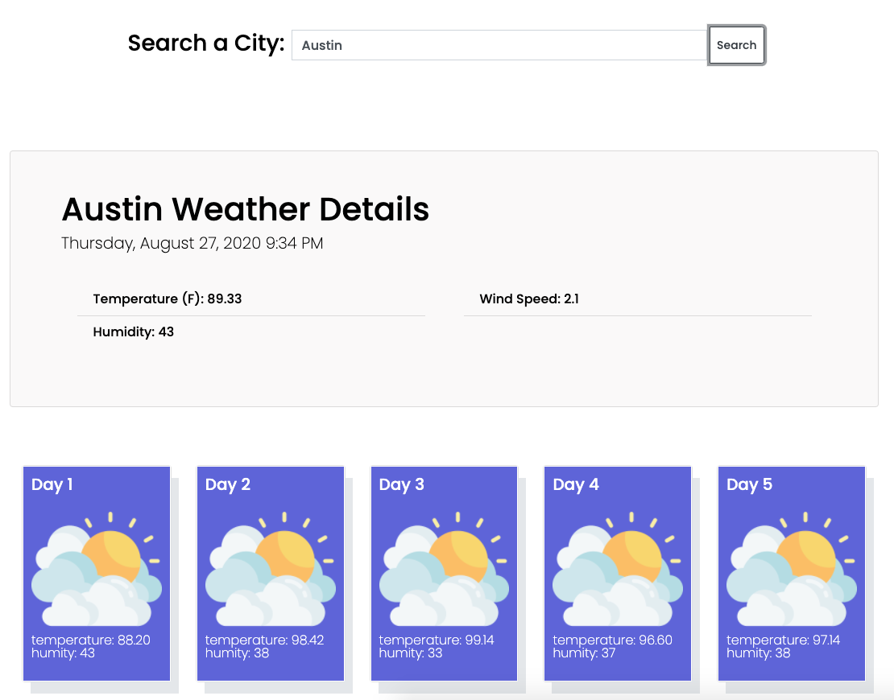

# weather-dashboard
homework 06- weather dashboard

 Here is my responsive weather dashboard using the API, Javascrip, JQuery and Bootstrap CSS framework. 
 When a user searches a city a current weather forcast appears including Temperature, Humidity and Wind speed. 
 In addition a 5-day forcast is featured at the bottom of the page. 
 

 Here is a link to the deployed website: https://emgal-aguirre.github.io/weather-dashboard/

Here are screen shots of my website. 

